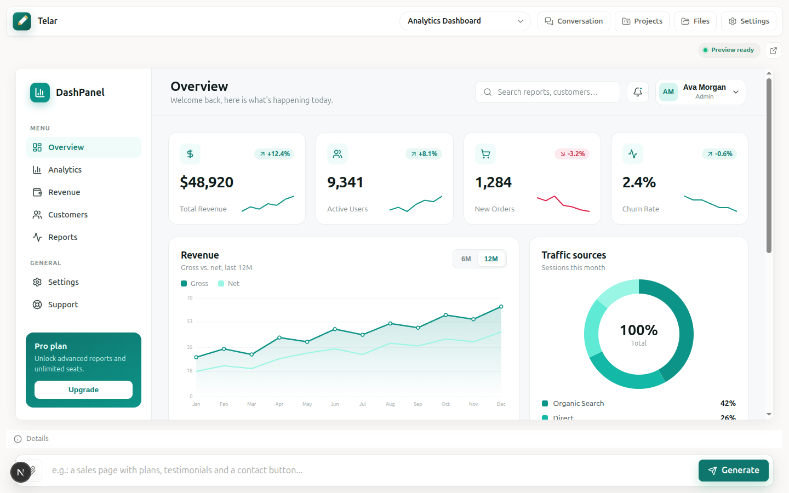
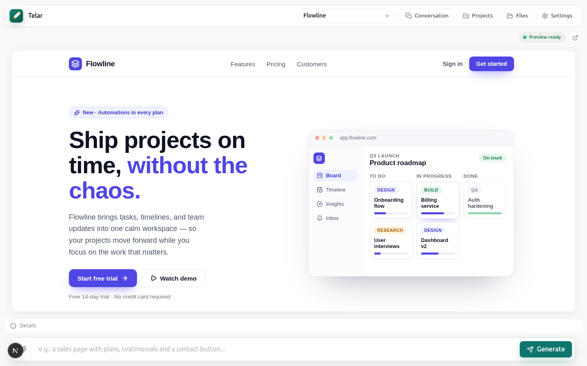
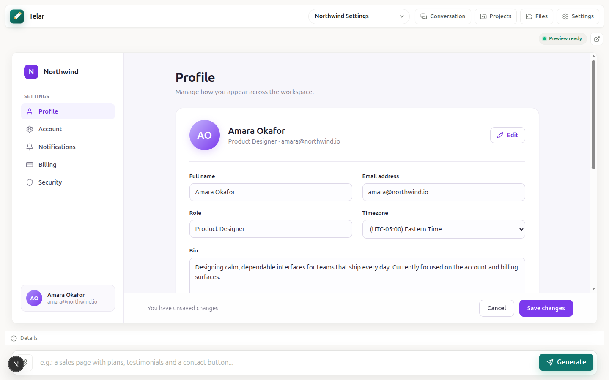

<div align="center">


# Telar

**A local-first AI workspace for generating, editing, previewing and exporting React interfaces from a prompt.**

_Telar_ is Portuguese for _loom_ — you describe a screen and it weaves the code, live.

[English](README.md) · [Português](README.pt-BR.md)

[](LICENSE)
[](https://nextjs.org)
[](https://react.dev)
[](https://www.typescriptlang.org)
[](https://vitest.dev)
[](https://playwright.dev)
[](#contributing)
[](#why-telar)
[](#internationalization)
[](https://github.com/renanmpimentel/telar/commits)
[](https://github.com/renanmpimentel/telar/stargazers)

</div>

---

## Showcase

Every screen below was generated from a single English prompt and rendered live in Telar's in-browser preview — no hand-written code.

**Analytics dashboard**

> _"A SaaS analytics dashboard with a left sidebar navigation, a top bar with search and a user avatar, four KPI summary cards, a large revenue line chart, a traffic-sources donut chart, and a recent-activity table. Clean modern light theme with a teal accent."_



**SaaS landing page**

> _"A modern landing page for a project-management SaaS: sticky nav, a bold hero with a product mockup, a three-column feature grid, a pricing section with three tiers, a testimonial, and a footer. Light theme with a vibrant indigo accent."_



**Account settings**

> _"A user account settings screen: a left sidebar with sections, a Profile panel with avatar and edit button, a two-column form, a Notifications card with toggles, and a sticky footer with Cancel and Save buttons. Light theme with a violet accent."_



## Why Telar

Telar brings the flow of a design canvas to code generation: describe the screen, attach references when you need them, and watch a real React app render in a live preview. Everything runs **local-first** — your projects live in the browser (IndexedDB), and you bring your own AI key or a local CLI. Nothing is uploaded to a Telar backend.

## Features

- 🧵 **Prompt to UI** — describe a screen and get a complete, editable React project.
- 👀 **Live preview** — the generated app runs in-browser via [WebContainers](https://webcontainers.io), with a lightweight mock mode for tests.
- 🗂️ **Projects** — create, switch, rename and delete projects; each keeps its own conversation and version history.
- ⏪ **Versions** — every generation is a restorable snapshot.
- 📎 **References** — attach text and image files to guide generation.
- 🧠 **Bring your own AI** — OpenAI, Anthropic (Claude), or a local **Claude CLI** / **Codex CLI** binary (no API key needed).
- ✍️ **Generation skills** — ships with a `frontend-design` skill or loads a custom one from a public GitHub `SKILL.md`.
- 📦 **Export** — download the whole project as a ZIP.
- 🌐 **Internationalization** — English and Portuguese, auto-detected and switchable.
- 🎨 **Calm, light UI** — a "Canvas + Dock" layout that keeps the preview center stage.

## Tech stack

- [Next.js 16](https://nextjs.org) (App Router) · [React 19](https://react.dev) · [TypeScript](https://www.typescriptlang.org)
- [WebContainers](https://webcontainers.io) for the in-browser preview runtime
- [Zod](https://zod.dev) for schema validation · [JSZip](https://stuk.github.io/jszip/) for export
- [Vitest](https://vitest.dev) (unit) · [Playwright](https://playwright.dev) (e2e)
- Plain CSS with design tokens — no UI framework

## Getting started

**Requirements:** Node.js 20+ and npm.

```bash
git clone https://github.com/renanmpimentel/telar.git
cd telar
npm install
npm run dev
```

Open <http://localhost:3000>. Open **Settings** to pick an AI provider and paste your API key (or select a detected local CLI).

### With Docker

```bash
docker compose up
```

### Environment variables

All are optional:

| Variable | Purpose |
| --- | --- |
| `NEXT_PUBLIC_PREVIEW_MODE` | Set to `mock` to render a lightweight preview without WebContainers (used in tests). |
| `TELAR_CLI_TIMEOUT_MS` | Timeout for local CLI generation (default `300000` = 5 min). |
| `TELAR_CLAUDE_BIN` | Path/name of the Claude CLI binary (default `claude`). |
| `TELAR_CODEX_BIN` | Path/name of the Codex CLI binary (default `codex`). |

## AI providers

Telar is **BYOK** (bring your own key). In **Settings → AI service** you can choose:

- **OpenAI** or **Claude** — paste an API key; the request is sent to the provider directly from the route handler.
- **Claude CLI** / **Codex CLI** — used automatically when the binary is detected on your `PATH`; runs locally, no API key. The CLI uses its own default model, so set a faster one in the **Model** field to speed things up.

## Internationalization

The UI ships in **English** and **Portuguese**. The locale is auto-detected from the browser (falling back to English) and can be changed any time in **Settings → Language**; the choice is persisted locally. Strings live in [`src/lib/i18n/dictionaries.ts`](src/lib/i18n/dictionaries.ts) — add a locale by mirroring the `en` map.

## Scripts

| Script | Description |
| --- | --- |
| `npm run dev` | Start the dev server |
| `npm run build` | Production build |
| `npm run start` | Serve the production build |
| `npm run lint` | ESLint |
| `npm run typecheck` | TypeScript, no emit |
| `npm test` | Unit tests (Vitest) |
| `npm run test:e2e` | End-to-end tests (Playwright) |

## Project structure

```
src/
  app/            Next.js routes, layout, global styles, favicon
  components/     Workspace, preview pane, brand mark
  lib/
    ai/           Provider dispatch + CLI agent
    i18n/         Dictionaries, provider and hook
    preview/      WebContainer runtime + module cache
    project/      Types, templates, references, generation skills
    storage/      Local (IndexedDB) project persistence
    export/       ZIP export
```

## Contributing

Contributions are welcome! Please open an issue to discuss substantial changes first. Before opening a PR, run `npm run lint`, `npm run typecheck` and `npm test`.

## License

[MIT](LICENSE) © Renan Pimentel
